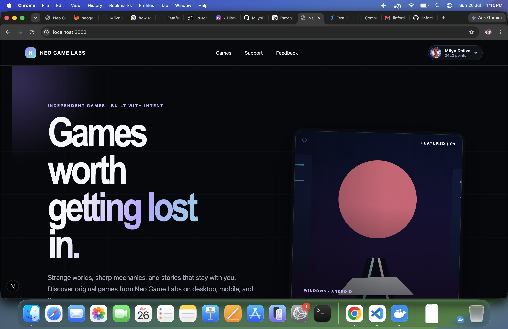
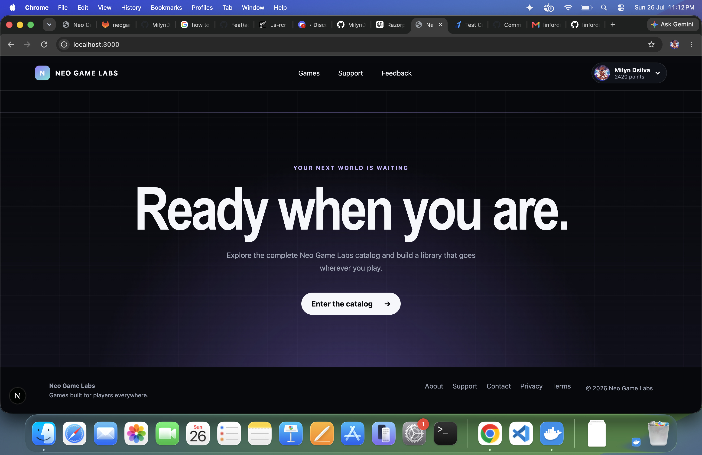
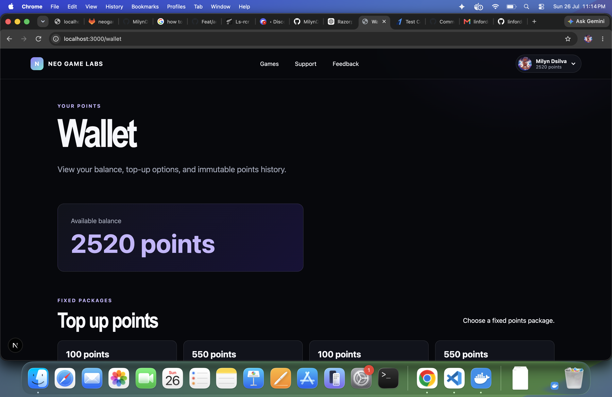
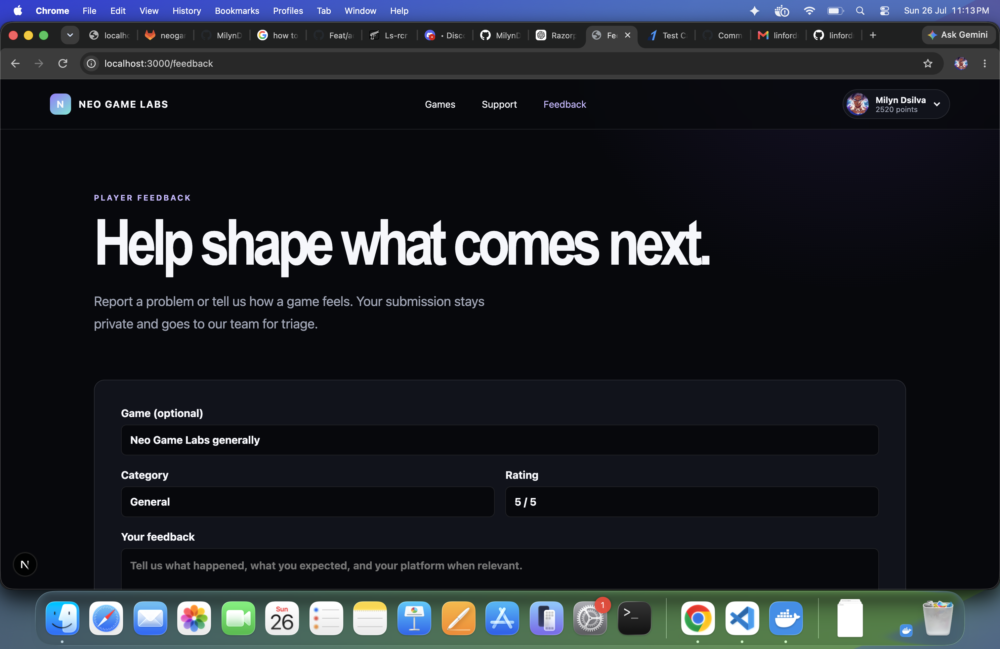

# Neo Game Labs Platform

Customer-facing game catalog, points wallet, purchase library, and feedback
platform for `neogamelabs.com`.

## Product preview

Discover original games through a cinematic storefront designed for players.

<p align="center">
  
</p>

<p align="center">
  
</p>

Players can manage their points wallet and send private, game-specific feedback
from the same account experience.

<table>
  <tr>
    <td width="50%">
      
    </td>
    <td width="50%">
      
    </td>
  </tr>
  <tr>
    <td align="center"><strong>Points wallet</strong></td>
    <td align="center"><strong>Player feedback</strong></td>
  </tr>
</table>

## Applications

- `apps/web`: Next.js customer website
- `apps/admin`: independently deployable Next.js operations dashboard
- `apps/api`: NestJS API
- `packages/contracts`: Shared API schemas and TypeScript types

## Prerequisites

- Node.js 22 or newer
- pnpm 10
- Docker with Compose

## Local setup

```bash
npm install --global pnpm@10.17.0
pnpm install
cp .env.example apps/api/.env
cp .env.example apps/web/.env.local
cp .env.example apps/admin/.env.local
docker compose up -d
pnpm --filter @neogamelabs/api seed:catalog
pnpm --filter @neogamelabs/api seed:downloads
pnpm --filter @neogamelabs/api seed:wallet
pnpm dev
```

The customer application runs at `http://localhost:3000`, and the protected
admin dashboard runs at `http://localhost:3100`. API liveness is available
at `http://localhost:4000/v1/health`, and MongoDB readiness at
`http://localhost:4000/v1/health/ready`. The catalog, download, and wallet seeds
are idempotent and can be rerun safely. The seeded download is a small test
artifact; production game builds must be stored outside Git in private object
storage.

## Admin dashboard

Set the same long random `ADMIN_API_KEY` in `apps/api/.env` and
`apps/admin/.env.local`. Set `ADMIN_DASHBOARD_USERNAME` and
`ADMIN_DASHBOARD_PASSWORD` only in the admin app environment. The browser
receives neither the admin API key nor database credentials.

The dashboard provides catalog publishing, point-price and featured controls,
private-feedback triage with internal notes, read-only customer wallet
visibility, controlled point credits, platform metrics, and an immutable admin
action trail. New customers receive a one-time 150-point welcome credit when
their points account is first created. See
[the admin operations guide](docs/operations/admin-dashboard.md).

Operational kill switches are configured with `TOP_UPS_ENABLED`,
`POINT_PURCHASES_ENABLED`, and `DOWNLOADS_ENABLED`. Top-ups default to disabled;
see [the launch runbook](docs/operations/launch-runbook.md) before changing
production flags.

Production-style API and standalone web containers are documented in
[the staging deployment guide](docs/operations/staging-deployment.md).

To test point purchases without a payment provider, credit one local customer
with an idempotent development-only ledger adjustment:

```bash
CUSTOMER_EMAIL=player@example.com POINTS=1000 \
  pnpm --filter @neogamelabs/api seed:wallet-credit
```

This command refuses to run when `NODE_ENV=production`.

## Google sign-in

Google sign-in remains disabled until credentials are configured. Create a Web
application in Google Cloud, add
`http://localhost:4000/v1/auth/google/callback` as an authorized redirect URI,
and set `GOOGLE_CLIENT_ID` and `GOOGLE_CLIENT_SECRET` in `apps/api/.env`.
Production and staging must use separate OAuth clients and HTTPS callback URLs.

## Razorpay test checkout

Set `RAZORPAY_KEY_ID`, `RAZORPAY_KEY_SECRET`, and
`RAZORPAY_WEBHOOK_SECRET` in `apps/api/.env`, then enable test top-ups with
`TOP_UPS_ENABLED=true`. Configure Razorpay Standard Checkout for automatic
capture and create a test-mode webhook for:

```text
payment.captured
payment.failed
```

The webhook URL is
`https://<public-api-host>/v1/payments/razorpay/webhook`. Razorpay webhooks
require a public HTTPS endpoint; local checkout confirmation still performs
server-side signature and captured-payment verification. Never commit Razorpay
keys or webhook secrets. See the
[Razorpay operations guide](docs/operations/razorpay.md) for test setup,
webhooks, rotation, and launch requirements.

## Validation

```bash
pnpm format:check
pnpm lint
pnpm typecheck
pnpm test
pnpm build
```

See [the product roadmap](docs/roadmap/README.md) for delivery phases and
[the architecture decisions](docs/roadmap/architecture-decisions.md) for the
database and financial consistency design.
